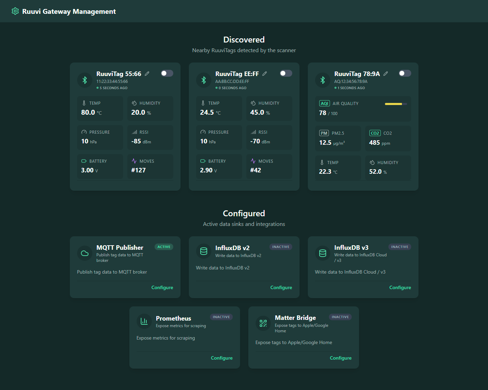

# ruuvi-go-gateway

**ruuvi-go-gateway** is a lightweight replacement for the physical [Ruuvi Gateway](https://ruuvi.com/gateway/), allowing you to collect data from RuuviTags using a Raspberry Pi or any Linux device with a Bluetooth adapter.

It mimics the Ruuvi Gateway's MQTT and HTTP formats but adds significant new capabilities, including a modern Web UI, direct InfluxDB support, and Prometheus metrics.



### Features

- **Modern Web UI**: View real-time tag data (Temperature, Humidity, Pressure, Voltage, RSSI, Movement).
- **Ruuvi Air Support**: Full support for Ruuvi Air (Format E1) and Format 6 tags, including PM2.5, CO2, VOC, NOX, and Illuminance.
- **Multiple Data Sinks**:
  - **MQTT**: Publish to Home Assistant or other brokers.
  - **InfluxDB v2 & v3**: Direct writing to time-series databases.
  - **Prometheus**: Expose metrics for scraping.
- **Dockerized**: Easy deployment on Raspberry Pi (ARMv7/ARM64) and x86 systems.

### Installation (Docker - Recommended)

The easiest way to run the gateway is using Docker.

1.  **Clone the repository** (or download `docker-compose.yml` and `config.sample.yml`).
2.  **Create your configuration**:
    ```bash
    cp config.sample.yml config.yml
    ```
    Edit `config.yml` to enable your desired sinks (MQTT, InfluxDB, etc.).
3.  **Start the container**:
    ```bash
    docker compose up -d
    ```

This uses the pre-built image: `ghcr.io/saavuori/ruuvi-go-gateway`.

### Accessing the Web UI

Once running, the Web UI is available at:
`http://<your-pi-ip>:8080`

You can configure the port in `config.yml` under `http_listener`.

### Requirements

- Linux-based OS (Raspberry Pi OS is perfect)
- Bluetooth adapter (Internal or USB)
- Docker & Docker Compose

### Configuration

Check [config.sample.yml](./config.sample.yml) for all available options.
The configuration supports:
- **Allowlisting**: Only process specific MAC addresses.
- **Tag Naming**: Assign human-readable names to MAC addresses.
- **Advanced Sinks**: Fine-tune interval/threshholds for MQTT and InfluxDB.

### Building Locally

To build and run from source:

```bash
docker build -t ruuvi-go-gateway .
docker run --net=host -v $(pwd)/config.yml:/app/config.yml:ro ruuvi-go-gateway
```
